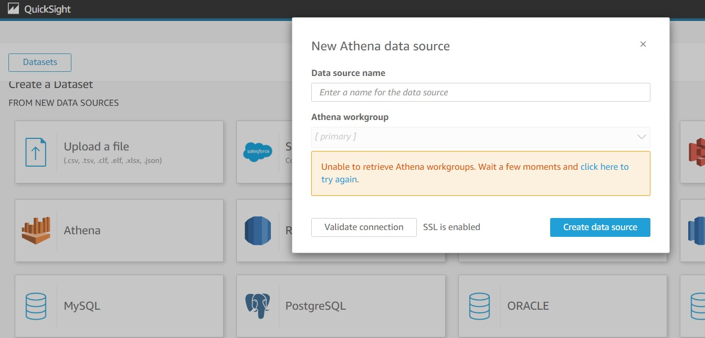
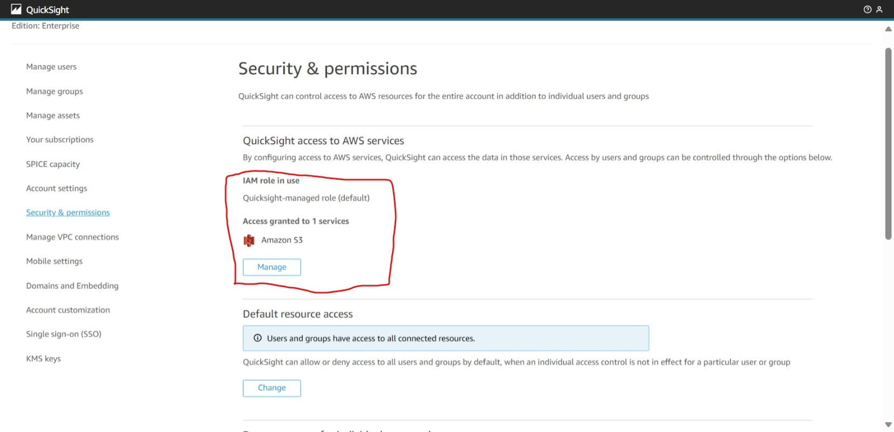

# AWS QuickSight Dataset with DynamoDB using Athena DataSource

## Introduction
AWS QuickSight can't connect to DynamoDB directly for DataSet as DynamoDB is NoSQL database. Here, Athena service can be used to bring SQL capability to query DynamoDB.

## Athena Configuration Steps

## QuickSight Configuration Steps

### Problem Statement
While creating Dataset in AWS QuickSight with Athena, getting error `Unable to retrieve Athena workgroups. Wait a few moments and click here to try again.`. 
 

#### Rootcause
As QuickSight doesn't have permission to access Athena this issue occurs.   

#### Solution
* In QuickSight, Navigate to the page `Manage QuickSight> Security & Permissions` as Admin role user.
* Check the QuickSight Access to AWS Services granted already. Here, Need to add Athena service.

* In the permission page, need to grant permission to S3 buckets and Lambda Functions associated to Athena.

