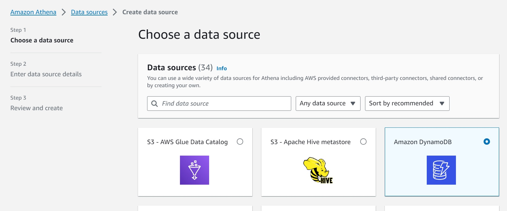
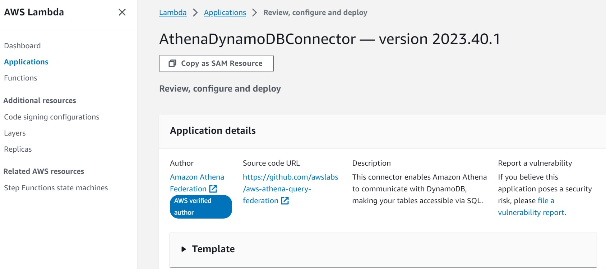
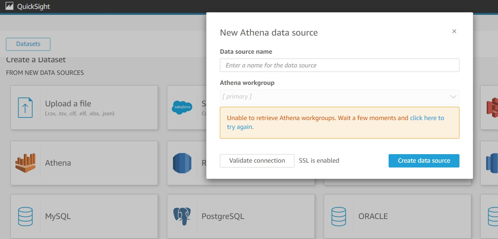
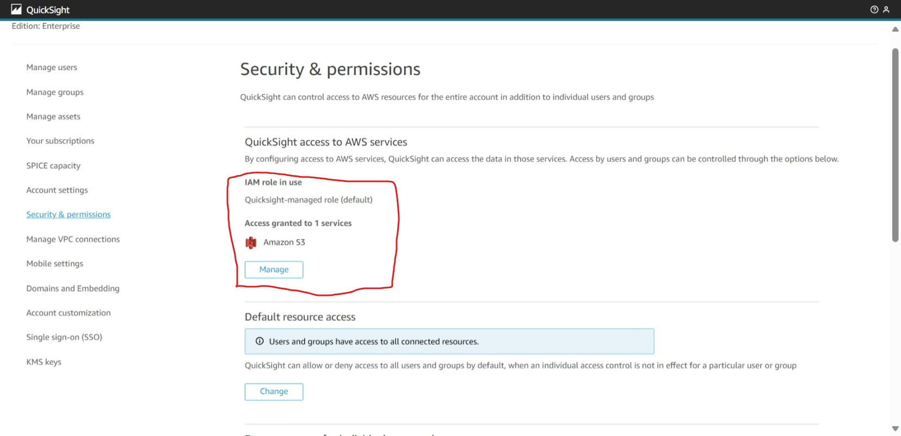

# AWS QuickSight Dataset with DynamoDB using Athena DataSource

## Introduction
AWS QuickSight can't connect to DynamoDB directly for DataSet as DynamoDB is NoSQL database. Here, Athena service can be used to bring SQL capability to query DynamoDB.

## Athena Configuration Steps
* Step 1 - Create Datasource by selecting DynamoDB.

* Step 2
    * Enter Data source name and description. 
    * **Important** Deploy AthenaDynamoDBConnector Lambda Function by clicking/launching the Create Lambda Function from Data Source creation page. 
        * Lambda Creation page will show the details. Lambda function name can be given as our need and deploy.
        * Once deployed, this function needs to be referred in Lambda Function.
 
* Step 3 - Review and Create Data Source.

## QuickSight Configuration Steps

* In QuickSight, navigate to `Dataset > Create DataSet` page. 
* Here, select Athena as Data Source, and will be getting popup for Athena data source configuration. 
* If error message `Unable to retrieve Athena workgroups. Wait a few moments and click here to try again.` is displayed, follow below steps to resolve the issue.  

### Athena Permission for QuickSight
While creating Dataset in AWS QuickSight with Athena, getting error `Unable to retrieve Athena workgroups. Wait a few moments and click here to try again.`. 

As QuickSight doesn't have permission to access Athena this issue occurs.   

#### Solution
* In QuickSight, Navigate to the page `Manage QuickSight> Security & Permissions` as Admin role user.
* Check the QuickSight Access to AWS Services granted already. Here, Need to add Athena service.

* In the permission page, need to grant permission to S3 buckets and Lambda Functions associated to Athena.

